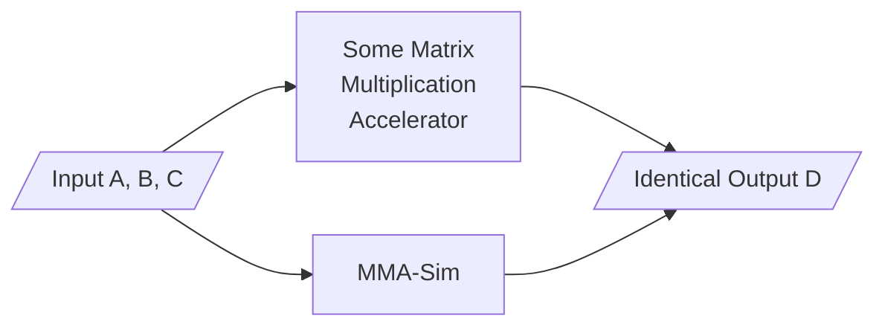

# MMA-Sim: A Bit-Accurate Behavior Simulator for Matrix Multiplication Accelerators

MMA-Sim can simulate the matrix multiply-accumulate operation `D=A*B+C` and produce the outputs **bit-wise identical** with the outputs of [Tensor Cores](https://www.nvidia.com/en-us/data-center/tensor-cores/) and [Matrix Cores](https://rocm.docs.amd.com/en/latest/conceptual/gpu-arch/mi300.html).



MMA-Sim precisely models the numerical behaviors of all generations of Tensor Cores and Matrix Cores, and reveals their design differences in multiply-add implementations, accumulation orders, rounding modes and internal precisions. 

Citation of the technical report:
```
Coming soon
```

## How to use MMA-Sim

Platform requirements:

1. OS: Linux
2. Software: Python (>=3.10), PyTorch (>=2.6)

Installation:

```shell
git clone https://github.com/microsoft/MMA-Sim.git --depth=1
cd MMA-Sim
pip install -e .
```

Example on Ampere architecture:

```python
import torch
from mmasim.simulator.nv import MMA
A = torch.randn([16,16], dtype=torch.float16)
B = torch.randn([16,8], dtype=torch.float16)
C = torch.zeros([16,8], dtype=torch.float16)
MMA_Sim = MMA(arch="Ampere", qualifier="m16n8k16.f16.f16.f16.f16")
D_sim = MMA_Sim(A, B, C)
print(D_sim)
```

## How to verify the correctness

Additional requirements:

1. Hardware: A GPU with Tensor Core or Matrix Core
2. Software: CUDA (>=12.8) or ROCm (>=6.3)

Additional builds:

```shell
cd mmasim/intrinsic/impl
make your_gpu_architecture.so
cd -
```

Supported GPU architectures:

```
nv_volta nv_turing nv_ampere nv_adalovelace nv_hopper nv_blackwell nv_rtxblackwell
amd_cdna1 amd_cdna2 amd_cdna3
```

Example followup (assuming your GPU architecture is Ampere):

```python
from mmasim.kernels.nv_ampere import mma_kernels
intrinsic = mma_kernels["m16n8k16.f16.f16.f16.f16"]
D_real = intrinsic(A, B, C)
print(D_real)
is_bitwise_equal = D_sim.view(torch.uint16) == D_real.cpu().view(torch.uint16)
print(is_bitwise_equal)
```

Additionally, you can run `python tests/test_your_gpu_architecture.py` to verify the correctness for all matrix multiplication instructions on your GPU.

## Contributing

This project welcomes contributions and suggestions.  Most contributions require you to agree to a
Contributor License Agreement (CLA) declaring that you have the right to, and actually do, grant us
the rights to use your contribution. For details, visit [Contributor License Agreements](https://cla.opensource.microsoft.com).

When you submit a pull request, a CLA bot will automatically determine whether you need to provide
a CLA and decorate the PR appropriately (e.g., status check, comment). Simply follow the instructions
provided by the bot. You will only need to do this once across all repos using our CLA.

This project has adopted the [Microsoft Open Source Code of Conduct](https://opensource.microsoft.com/codeofconduct/).
For more information see the [Code of Conduct FAQ](https://opensource.microsoft.com/codeofconduct/faq/) or
contact [opencode@microsoft.com](mailto:opencode@microsoft.com) with any additional questions or comments.

## Trademarks

This project may contain trademarks or logos for projects, products, or services. Authorized use of Microsoft
trademarks or logos is subject to and must follow
[Microsoft's Trademark & Brand Guidelines](https://www.microsoft.com/legal/intellectualproperty/trademarks/usage/general).
Use of Microsoft trademarks or logos in modified versions of this project must not cause confusion or imply Microsoft sponsorship.
Any use of third-party trademarks or logos are subject to those third-party's policies.